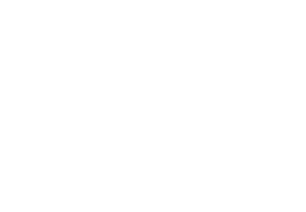

The processor is a central processing unit ( `cpu` ). It's a eletronical component of the computer that handle machine instructions.

## Historical Context

In 1946, the ENIAC (Electronic Numerical Intergrator And Computer) was the first electronical computer, weighting about 30 tons, and working with a decimal numeral system.

Today our system are way smaller thanks to inventions like the transistor that has been invented in 1947, creating a revolution. It allowed for the creation of the integrated circuit that are a key component to our modern machines.

The `4004` was the first micro-processor, build in 1971 by intel, equivalent to our current processor. However, the first micro-processor that could be used with a central unit was the intel `8080` .

## The von neuman model

This model was presented within the EDVAC project in 1945, and makes the fondamental for the modern constitution of the computer of today.

It is composed by 4 parts:
-  `ALU` (Arithmetic logical unit) that compute the calculations
- The Control Unit that sequence the information
- The memory that store the program and data
- The `I/O` the handle physical interfaces.

